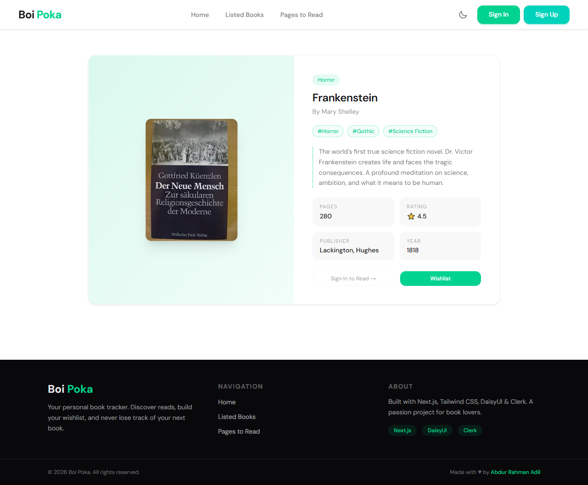

#  Boi Tori

A modern book discovery and reading platform built with Next.js. Browse curated books, manage your wishlist, and track your reading progress — all in one place.

## ✨ Features

- 🔍 Browse a curated collection of Bengali & English books
- ❤️ Wishlist your favourite reads
- 📊 Track pages to read with visual charts
- 🌗 Light & Dark mode
- 🔐 User authentication (Clerk)
- 📱 Fully responsive design

## 🛠️ Tech Stack

| Technology | Purpose |
|---|---|
| Next.js 16 | Framework |
| Tailwind CSS v4 | Styling |
| DaisyUI v5 | UI Components |
| Clerk | Authentication |
| Recharts | Data Visualization |

## 📸 Screenshots

### Home


### All Books


### Pages to Read


## 🚀 Getting Started
```bash
git clone https://github.com/your-username/boi-tori
cd boi-tori
pnpm install
pnpm dev
```

## ⚠️ Note

> This is a preview version. No database is used — book data is served from a local JSON file.

## 👨‍💻 Author

**Abdur Rahman Adil**